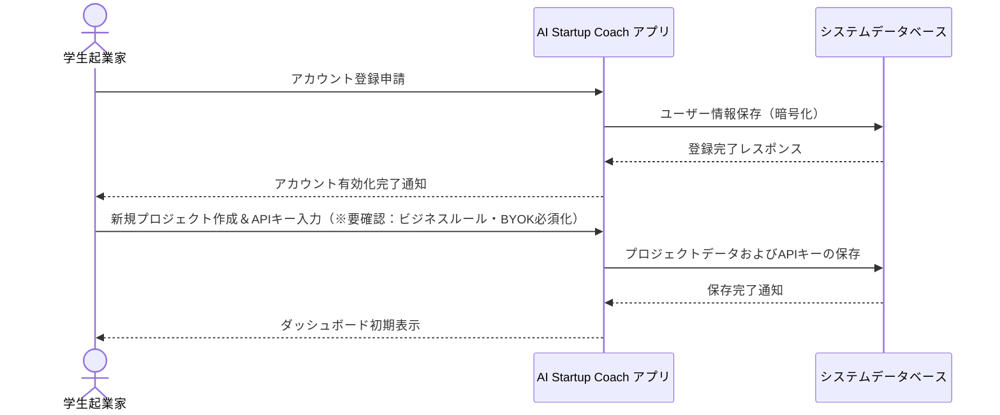
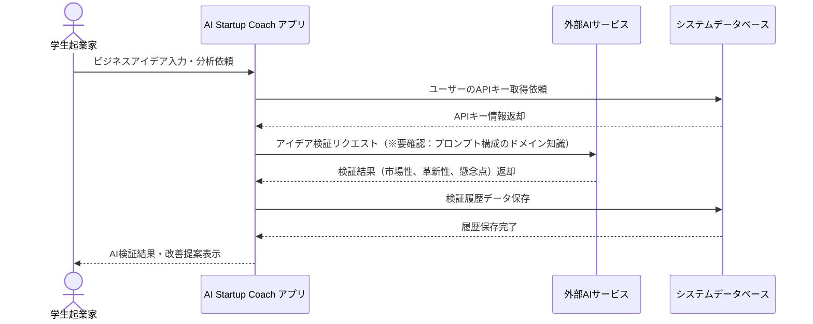
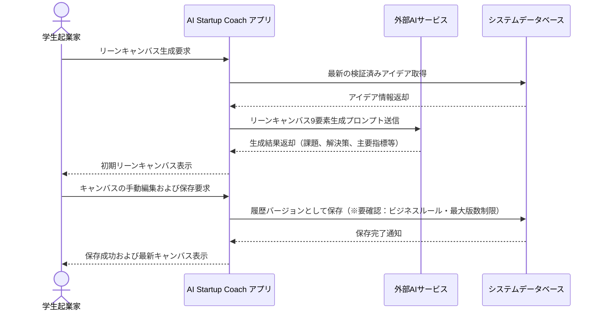
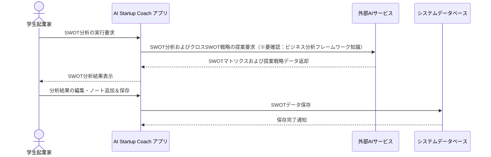
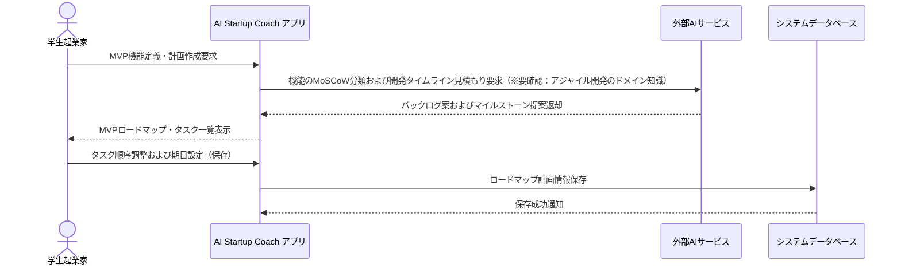
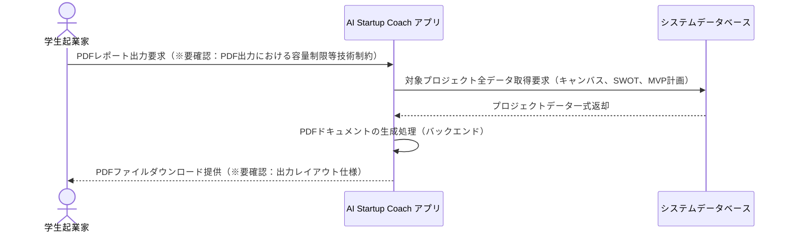

# 業務フロー

## プロジェクト初期設定フロー

学生がアカウントを登録し、スタートアッププロジェクトを作成して、個人のAI APIキー（BYOK）を設定するまでの一連のフロー（※要確認：技術要件・APIキーのセキュリティ保持制約）

**参加者:** 学生起業家 (actor)、AI Startup Coach アプリ (system)、システムデータベース (database)

**メッセージフロー:**
- 学生起業家 → AI Startup Coach アプリ: アカウント登録申請
- AI Startup Coach アプリ → システムデータベース: ユーザー情報保存（暗号化）
  - システムデータベース ← AI Startup Coach アプリ: 登録完了レスポンス
  - AI Startup Coach アプリ ← 学生起業家: アカウント有効化完了通知
- 学生起業家 → AI Startup Coach アプリ: 新規プロジェクト作成＆APIキー入力（※要確認：ビジネスルール・BYOK必須化）
- AI Startup Coach アプリ → システムデータベース: プロジェクトデータおよびAPIキーの保存
  - システムデータベース ← AI Startup Coach アプリ: 保存完了通知
  - AI Startup Coach アプリ ← 学生起業家: ダッシュボード初期表示

## AIアイデア検証フロー

入力されたビジネスアイデアをAIが分析し、実現可能性や市場の可能性、初期の改善提案をフィードバックするフロー

**参加者:** 学生起業家 (actor)、AI Startup Coach アプリ (system)、外部AIサービス (external)、システムデータベース (database)

**メッセージフロー:**
- 学生起業家 → AI Startup Coach アプリ: ビジネスアイデア入力・分析依頼
- AI Startup Coach アプリ → システムデータベース: ユーザーのAPIキー取得依頼
  - システムデータベース ← AI Startup Coach アプリ: APIキー情報返却
- AI Startup Coach アプリ → 外部AIサービス: アイデア検証リクエスト（※要確認：プロンプト構成のドメイン知識）
  - 外部AIサービス ← AI Startup Coach アプリ: 検証結果（市場性、革新性、懸念点）返却
- AI Startup Coach アプリ → システムデータベース: 検証履歴データ保存
  - システムデータベース ← AI Startup Coach アプリ: 履歴保存完了
  - AI Startup Coach アプリ ← 学生起業家: AI検証結果・改善提案表示

## リーンキャンバス自動生成フロー

検証済みアイデアに基づき、AIがリーンキャンバスの9要素を自動生成し、ユーザーが手動調整して保存するフロー

**参加者:** 学生起業家 (actor)、AI Startup Coach アプリ (system)、外部AIサービス (external)、システムデータベース (database)

**メッセージフロー:**
- 学生起業家 → AI Startup Coach アプリ: リーンキャンバス生成要求
- AI Startup Coach アプリ → システムデータベース: 最新の検証済みアイデア取得
  - システムデータベース ← AI Startup Coach アプリ: アイデア情報返却
- AI Startup Coach アプリ → 外部AIサービス: リーンキャンバス9要素生成プロンプト送信
  - 外部AIサービス ← AI Startup Coach アプリ: 生成結果返却（課題、解決策、主要指標等）
  - AI Startup Coach アプリ ← 学生起業家: 初期リーンキャンバス表示
- 学生起業家 → AI Startup Coach アプリ: キャンバスの手動編集および保存要求
- AI Startup Coach アプリ → システムデータベース: 履歴バージョンとして保存（※要確認：ビジネスルール・最大版数制限）
  - システムデータベース ← AI Startup Coach アプリ: 保存完了通知
  - AI Startup Coach アプリ ← 学生起業家: 保存成功および最新キャンバス表示

## SWOT分析フロー

ビジネスプランの強み・弱み・機会・脅威を分析し、マトリクス形式で戦略オプションを提案する一連のフロー

**参加者:** 学生起業家 (actor)、AI Startup Coach アプリ (system)、外部AIサービス (external)、システムデータベース (database)

**メッセージフロー:**
- 学生起業家 → AI Startup Coach アプリ: SWOT分析の実行要求
- AI Startup Coach アプリ → 外部AIサービス: SWOT分析およびクロスSWOT戦略の提案要求（※要確認：ビジネス分析フレームワーク知識）
  - 外部AIサービス ← AI Startup Coach アプリ: SWOTマトリクスおよび提案戦略データ返却
  - AI Startup Coach アプリ ← 学生起業家: SWOT分析結果表示
- 学生起業家 → AI Startup Coach アプリ: 分析結果の編集・ノート追加＆保存
- AI Startup Coach アプリ → システムデータベース: SWOTデータ保存
  - システムデータベース ← AI Startup Coach アプリ: 保存完了通知

## MVPロードマップ策定フロー

コア機能の定義、MoSCoW法を用いた優先順位付け、および開発スケジュールのロードマップ作成支援フロー

**参加者:** 学生起業家 (actor)、AI Startup Coach アプリ (system)、外部AIサービス (external)、システムデータベース (database)

**メッセージフロー:**
- 学生起業家 → AI Startup Coach アプリ: MVP機能定義・計画作成要求
- AI Startup Coach アプリ → 外部AIサービス: 機能のMoSCoW分類および開発タイムライン見積もり要求（※要確認：アジャイル開発のドメイン知識）
  - 外部AIサービス ← AI Startup Coach アプリ: バックログ案およびマイルストーン提案返却
  - AI Startup Coach アプリ ← 学生起業家: MVPロードマップ・タスク一覧表示
- 学生起業家 → AI Startup Coach アプリ: タスク順序調整および期日設定（保存）
- AI Startup Coach アプリ → システムデータベース: ロードマップ計画情報保存
  - システムデータベース ← AI Startup Coach アプリ: 保存成功通知

## プロジェクトレポート出力フロー

これまでに構築したキャンバス、SWOT、ロードマップ等の各種アウトプットを統合PDFファイルとしてエクスポートするフロー

**参加者:** 学生起業家 (actor)、AI Startup Coach アプリ (system)、システムデータベース (database)

**メッセージフロー:**
- 学生起業家 → AI Startup Coach アプリ: PDFレポート出力要求（※要確認：PDF出力における容量制限等技術制約）
- AI Startup Coach アプリ → システムデータベース: 対象プロジェクト全データ取得要求（キャンバス、SWOT、MVP計画）
  - システムデータベース ← AI Startup Coach アプリ: プロジェクトデータ一式返却
- AI Startup Coach アプリ → AI Startup Coach アプリ: PDFドキュメントの生成処理（バックエンド）
  - AI Startup Coach アプリ ← 学生起業家: PDFファイルダウンロード提供（※要確認：出力レイアウト仕様）

